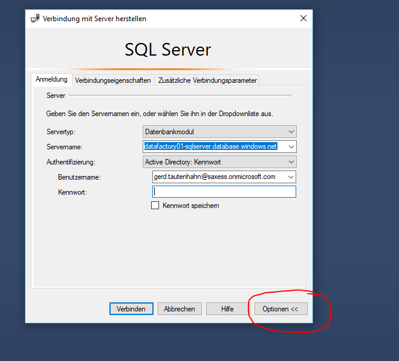
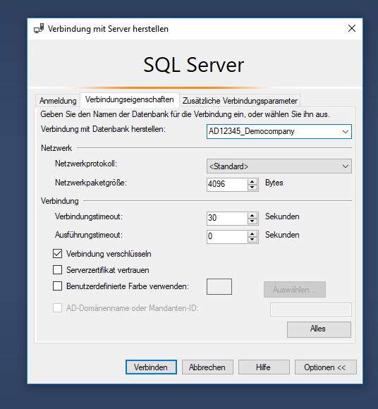

# How to Login into an Azure Database over SQL Server Management Studio

## Preconditions
* you must have login credentials - this may be by a Microsoft Account, which is member of the Azure AD, or via SQL Server Username / Password
* for your IP address the access to Azure DB is allowed

## Login on Server Level
If your login is allowed to access the master database, you can login in Server Level. You will see all databases of the server.

## Login on Database Level
If your login is not allowed to access the master database, you must login on Database Level and you can be connected to only one Database. 

