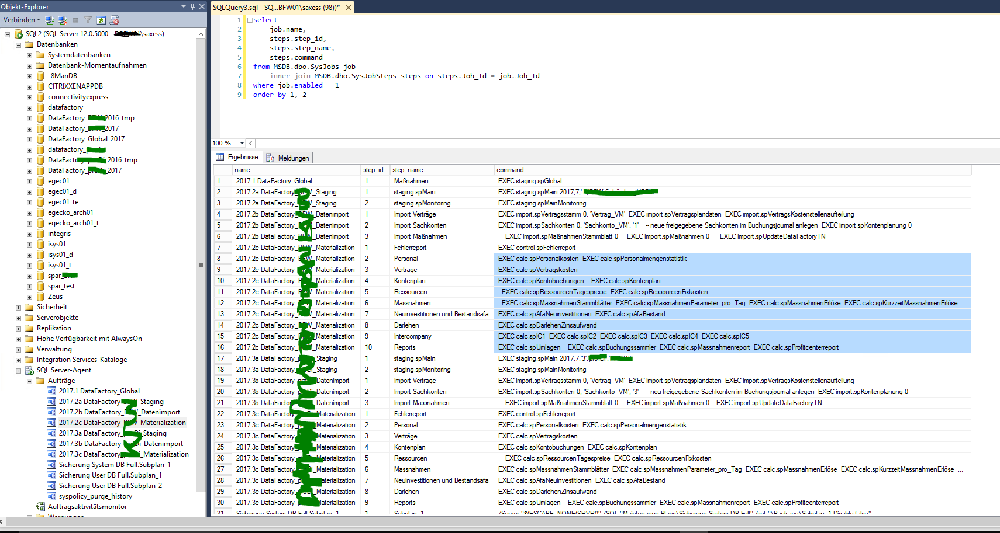

If you created many steps for an SQL Agent, you may want to execute this jobs on another computer for testing. 
You can export / import SQL Agent Jobs, but this is only helpful on a PC to backup and restore the job, not to transfer to another 
computer. 
It usually won't run there (any you can't import) due to different environment variables and user propertiers.

But you can extract all jobs SQL with this query and execute it as a script

