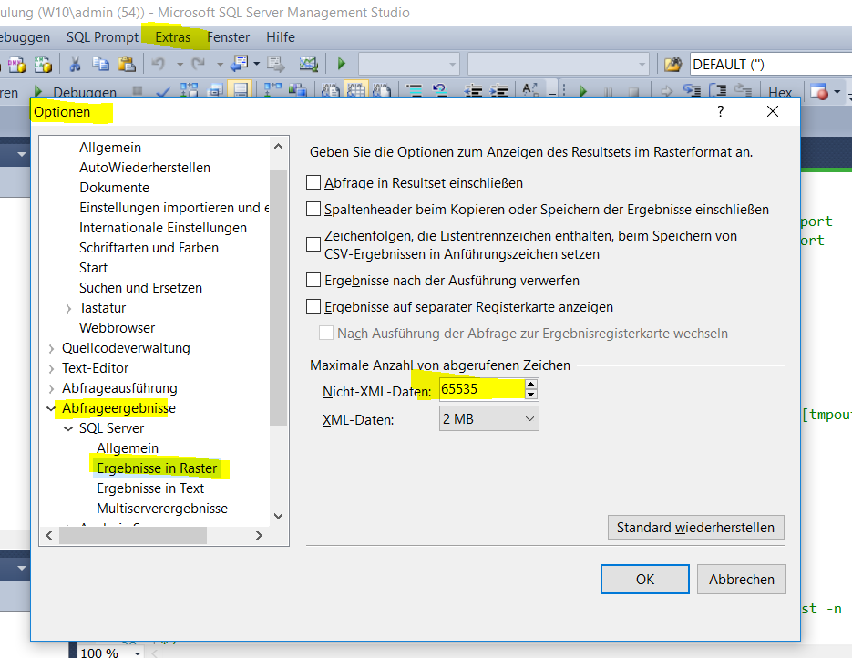

If you have any query, which returns long varchars, SQL Servermanagement Studio don't displays the whole content
## 1. Increase the ammount of showed characters in SSMS
* you can increase up to a maximum of 65k characters




## 2. Export the Data
You can export the data with the export wizard of SSMS:
* Export to File - use unicode
* write a Query like SELECT ParamterString FROM sx_pf_API_Log WHERE LogKey = 4444
* change in Query mapping the field size to a very high number
* you wil get an text file with the complete field content
Restrictions
* works not with SQL Express as there is no Export
* you don't want to export the results of an Stored procedure, which uses internal an #table (not supported from SSMS)

Use a custom query to export this data.

## 3. Store in a table and export table with bcp to a file
It works always

1. Execute this to store the results in a table
	````SQL
	IF  EXISTS (SELECT * FROM sys.objects WHERE object_id = OBJECT_ID(N'[dbo].[tmpout_Export]') AND type in (N'U'))
	DROP TABLE [dbo].[tmpout_Export]
	GO
	CREATE TABLE tmpout_Export (
		Command NVARCHAR(MAX)
		)
	INSERT INTO tmpout_Export
		EXEC sx_pf_EXPORT_Productline 'SQL','AT','1',1
	````

2. Copy this table Content in a file over a .bat file with this command  
	bcp.exe PlanningFactoryCars.dbo.tmpout_Export out import.sql -T -S localhost -n  -e error.log -c -C65001


