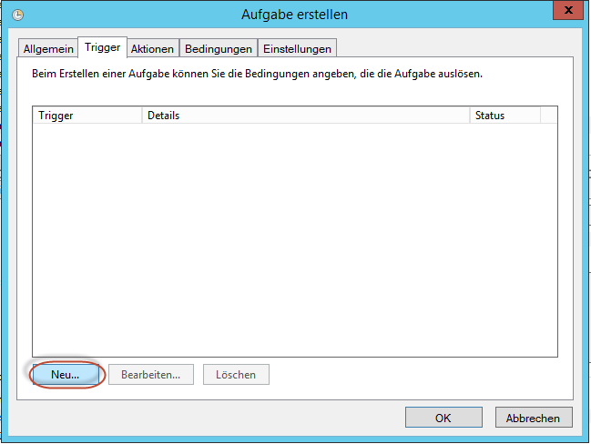
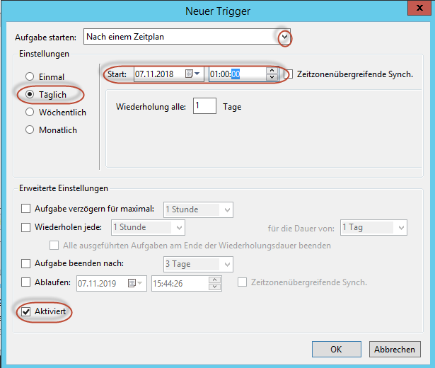

### Steps to configure a powerloading job

1. During Installation of WebApp set a user with full rights as powerloading user  

2. Generate a powershell script according to the example in the folder 'Powerloading example'

3. Configure a Microsoft Job

path to the powershell.exe (z.B.: C:\Windows\System32\WindowsPowerShell\v1.0\powershell.exe)

path of the powershellscript file (z.B.: -file "C:\GitHub\AD01513_BFW_DataFactory\Projekt Unternehmensplanung\1c. Prozess 2018\Powerloading.ps1") !Format einhalten

folder where the powershell script is located (z.B.: C:\GitHub\AD01513_BFW_DataFactory\Projekt Unternehmensplanung\1c. Prozess 2018)

