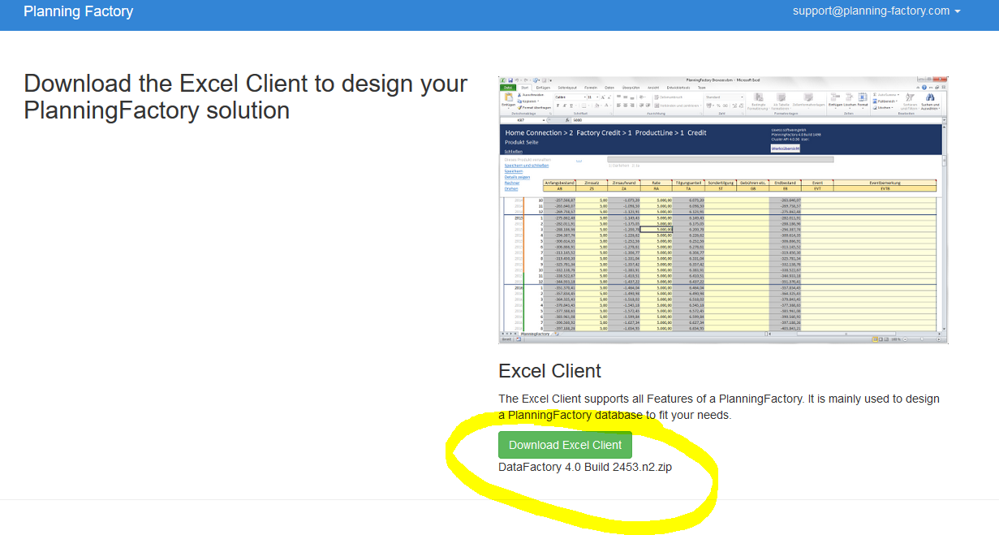
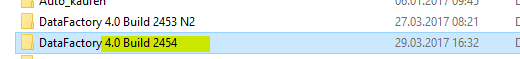
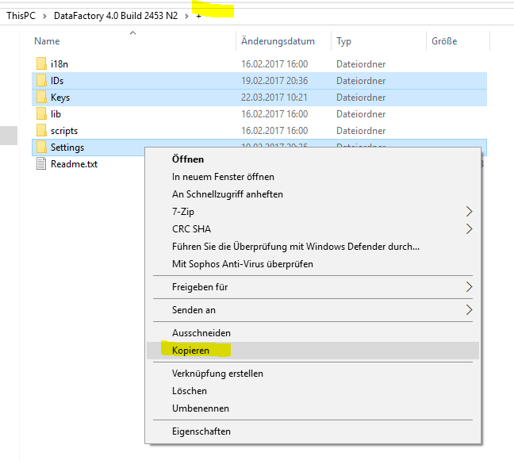
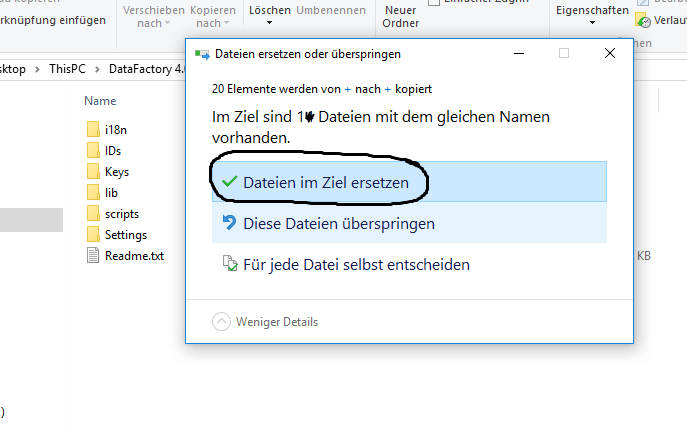

# How To update your DataFactory Browser to a new Version

It very simple - you just copy the ID, Keys and settings folder from the "+" folder of the old version to the new version.

### Download the new Version

### Unzip the new Version

### Copy the ID, Keys, Settings folder of the old version
(use Strg + Mouse to select multiple folders)

### Paste the ID, Keys, Settings folder to the new version, replacing existing content
(use Strg + Mouse to select multiple folders)

