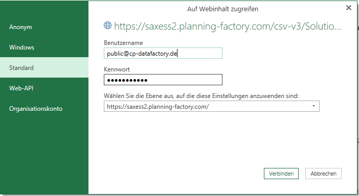
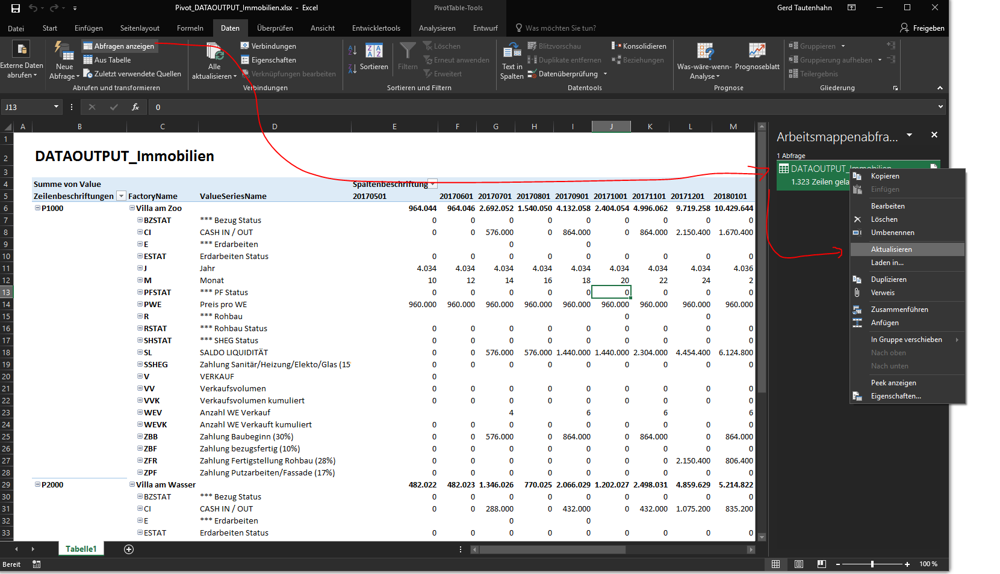

## How to create a local (and refreshable) Pivot Table from the DataFactory Webservice

### Precondition
* on the Server exists an Stored Procedure with Name sx_pf_DATAOUTPUT_[Anything] (only this SPs can be called as CSV) 
* this SPs has three Parameters, @Username, @FactoryID, @ProductlineID
* the SP is not called with its full name, only with the [Anything] this is called OutputType

you must prepare:
* the CSV Download URL for your cluster, it looks like https://factoryprovider.com/api/v4/csv/[Clustername]/[OutputType]/[FactoryID]/[ProductlineID]/
* at the end of the URL you can put the parameter "?separator=|" to tell the api which separator you like, the default is the pipe
(of course, the choosen delimiter must not be contained in text fields)
* The FactoyID / ProductlineID is optional, you can call also the whole cluster
* your login credentials are the same as for the login in the Webbrowser

This manual is written for Excel 2016, in Excel 2010/2013 the process is similar, but you must have installed the addin PowerQuery on your machine.

### Create a new Query

### Enter your URL and credentials

Check your URL in your Webbrowser first - it must work there also.

### Check the column delimiter

If the query has not been loaded correctly/ has not been loaded at all, please use the "refresh"-button. 

In order to move to the next step, please use the "process"-button.

### Delete the automaticly create step for Typ Definition
### Give the Query a better name than "Abfrage1" - this is the Name the table in your ThisWorkbookDatamodel will have

### Undo automatic Typ setting and set all ID Columns to Type text and Year Month to type integer

### Set Value Columns to Decimal-US with country coding !

### Load to Datamodel, not into the sheet

### Create a PivotTable

### Select Fields for the PivotTable

### Refresh the Data any time you like

