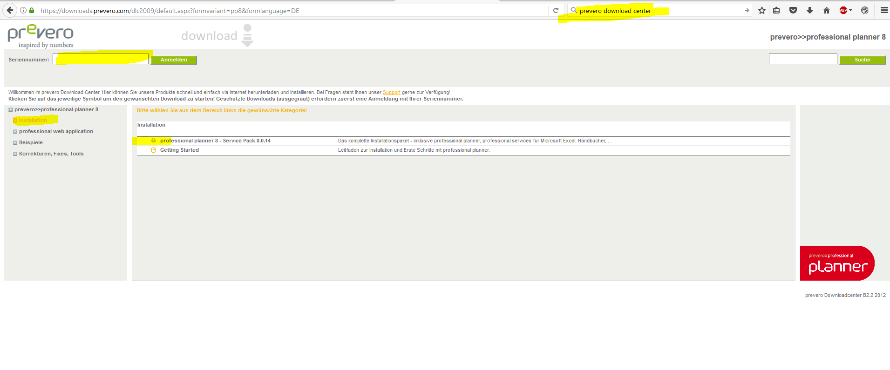

## Installation Preparemtens (Professional Planner)
If DataFactory is used togehter with Professional Planner, some limitations are important
* PP can't access Excel 64 Installations, only Excel 32 Bit
* PP should be used with SQL Server 2012 SP3

## Download SQL Server 2012 Express SP4
https://download.microsoft.com/download/B/6/4/B6488B3E-025A-4F4F-9475-9E55FB8C8EE3/SQLEXPRWT_x64_DEU.exe
  

## Installation of SQL Server
* Add "System" as SQL Server Administrator
* Activate TCP/IP Protokoll

## Download Professional Planner
You need a valid serial number for login on the Downloadpage.  
https://downloads.prevero.com/dlc2009/default.aspx?formvariant=pp8&formlanguage=DE
  

* Download Professional Planner 
* Start the downloaded exe file -> it will just unpack and create a folder with the installation files
* skip the autostarted dialog for installation
* open in the installation folder the subfolder "ProfessionalPlanner"
* start the setup.exe
* do standard installation
* open OLCAP Runtime
* enter instance name of SQL Server in Tab Settings (this ist "SQLExpress" if you did not modify)
* activate the software on the licence tab -> you should now see which edition you have and how long it runs
* start Professional Planner
* create a Session 
* create a Dataset in the session for testing
