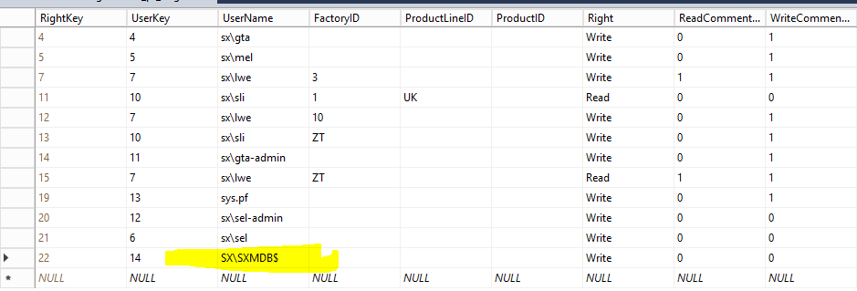

The SQL Server Agent can execute SQL Script or procedures regualary. This agent is very useful, but you have to consider some special points

### General
* it is not avaiable in SQL Express installations
* it must be configured to start as service with the computer, this must be done in service configuration
* You can do SQL Server Agent configuration only as sysadmin

### Right Configuration of Tasks
* Set the owner of the Task to a special user (after following step)  
  
* this user you must give in system database "msdb" the roles SQLAgent*, otherwise you can't select  
  
* you must give rights in the DataFactory Usermanagement to the SQL Server Agent User **SX\SXMDB$** -> [Domain]\[Machinename] (maybe to be extended with instance), this user will be logged as executing user
  

