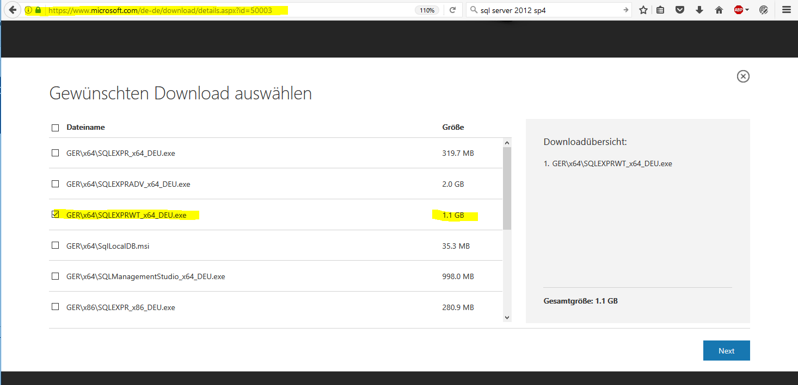

## Installation Preparemtens
If DataFactory is used togehter with Professional Planner, some limitations are important
* PP can access Excel 64 Installations
* PP should be used with SQL Server 2012 SP3

## Download SQL Server 2012 Express 

## Professional Planner
You need a valid serial number for login on the Downloadpage.  

