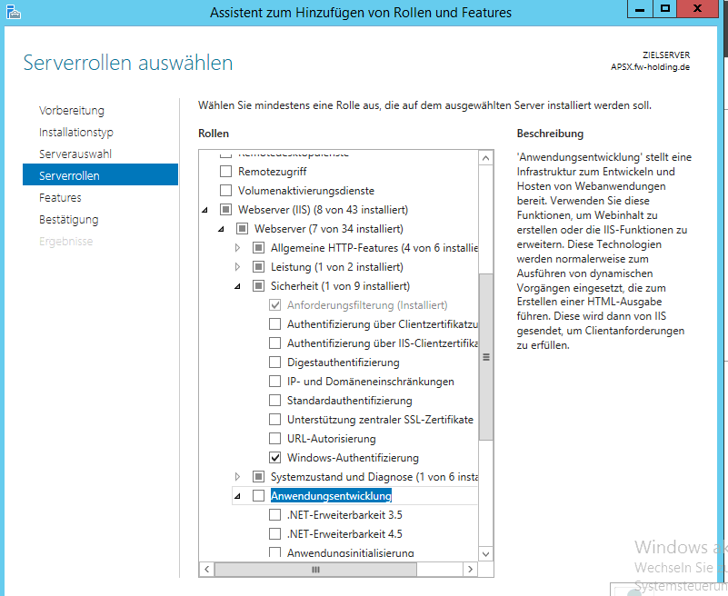

# Installation of the DataFactory WebComponents

## Preparations

### Add Roles and Features to you Win 2012 R2 Server

Start the Servermanager and edit Roles and Features  

Add Windows Auth to IIS  

Add ISAPI and ASP.NET 4.5  

### Create a DOMAIN User "Domain\FactoryService" - a Standard User, NO Admin Rights anywhere
(at the screenshot the domain is missing, we learnt it a bit later the hard way..)

Add this user to SQL Server  

Keep only public rights on server level  

Give role pf_PlanningFactoryService in the DataFactory Database  

## Do Configuration of IIS Server

Start IIS Manager  

Enter Authentication of Default Website  

Activate Windows Auth  

Deactivate Anonymous Auth  

Delete default Website content  

Unzip the DataFactory Application here  

Without Subdirectory on unzip  

Delete zip file after that, to have this directory structure  

Copy config.ini.example and rename to Config.ini  

Open config.ini from a Admin Notepad  

Delete SQL based connection string and use Windows Auth  

Do configuration of connection string to the DataFactory Database  
WindowsAuth = true/false means here if the Users will be identified by Windows or sxIDServer.

Set Identity of Application Pool to FactoryService   

Set Timeout   

Set Always running  

Restart Webserver (not only site) - as Site is "AlwaysRunning"

You should see this in any browser on localhost  

You should see your Factory on localhost/[DataBaseName]  

Give AppData Write Rights to FactoryService  

Tell the users the URL http://[Servername].Domain\[DataBaseName]  This should be FQDN e.g. http://web1.sx.intern/DataFactory

Other things to think on:  
* Maybe you must add this URL to the trusted Website for Internet Explorer
* Firefox don't support WindowsAuth in default - there is always a Pop-Up for credentials
* IE and Edge support WindowsAuth with Single SignOn

Enjoy for 5 minutes - and go on.
