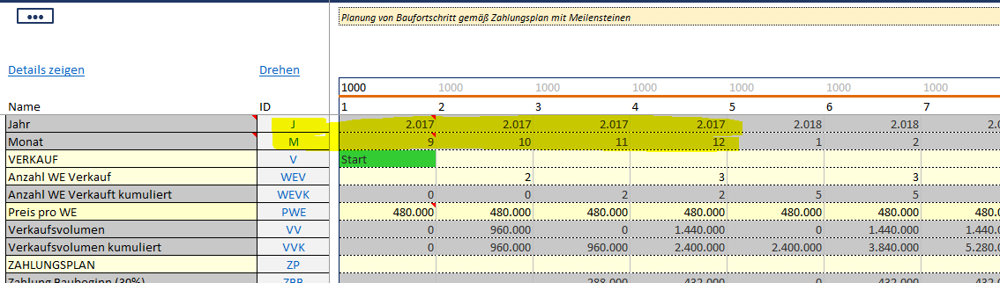

A Dynamic TimeID is created on runtime from ValueSeries


````SQL
/* 
In this view, the usual TimeID is replaced by a dynamic TimeID for Products having this.
Dynamic TimeID is detected, if the Template has the ValueSeries
J and M with Numeric Values
*/


SELECT 
   fV.FactoryID
  ,dF.NameShort AS FactoryName
  ,fV.ProductLineID
  ,dPL.NameShort AS ProductLineName
  ,fV.ProductID
  ,dP.NameShort AS ProductName
  ,fV.ValueSeriesID
  ,dVS.NameShort AS ValueSeriesName

  ,COALESCE(dTD.J*10000+dTD.M*100 + 1,fV.TimeID) AS TimeID --dynamic TimeID trumps usual TimeID

  ,CAST(fV.ValueInt AS money)/dVS.Scale AS Value
  ,fV.ValueText

FROM 
  -- Basic fact table (ValueInt, ValueText, ValueComment)
  sx_pf_fValues fV

  -- for Factory Attributes (Name, RespPerson...)
  LEFT JOIN sx_pf_dFactories dF ON 
    fV.FactoryKey = dF.FactoryKey

  -- for Productline Attributes (Name, RespPerson..)
  LEFT JOIN sx_pf_dProductLines dPL ON
    fV.ProductLineKey = dPL.ProductLineKey

  -- for Product Attributes (Name, Status, Globalattributes 1..25)
  LEFT JOIN sx_pf_dProducts dP ON
    fV.ProductKey = dP.ProductKey

  -- for ValueSeries Attributes (Effect, VisibilityLevel, NumericFlag)
  LEFT JOIN sx_pf_dValueSeries dVS ON 
    fV.ValueSeriesKey = dVS.ValueSeriesKey
	
  -- dynamic Time from Template Columns
  LEFT JOIN (

				SELECT
					 ProductKey
					,TimeID
					,[J]
					,[M]
				FROM
					(
					SELECT 
						 ProductKey
						,ValueSeriesID
						,TimeID
						,ValueInt

					FROM sx_pf_fValues

					WHERE ValueSeriesID IN ('J','M')
					) AS Source

				PIVOT(MAX(ValueInt) FOR ValueSeriesID IN ([J],[M])
					
					) AS Pivottable

				) AS dTD 
			ON	fV.ProductKey = dTD.ProductKey AND 
				fV.TimeID = dTD.TimeID

WHERE
   dF.FactoryID != 'ZT' -- Filter the Templates
  
````
 
