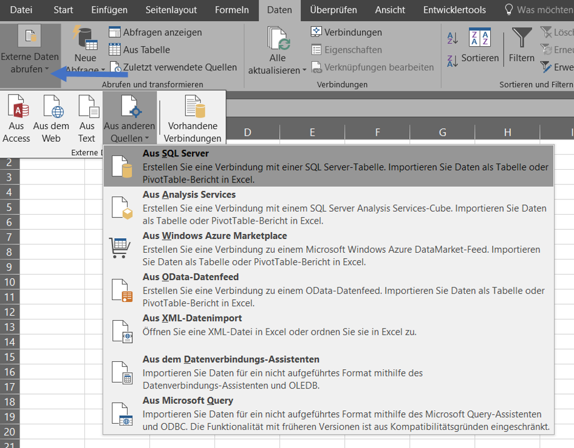
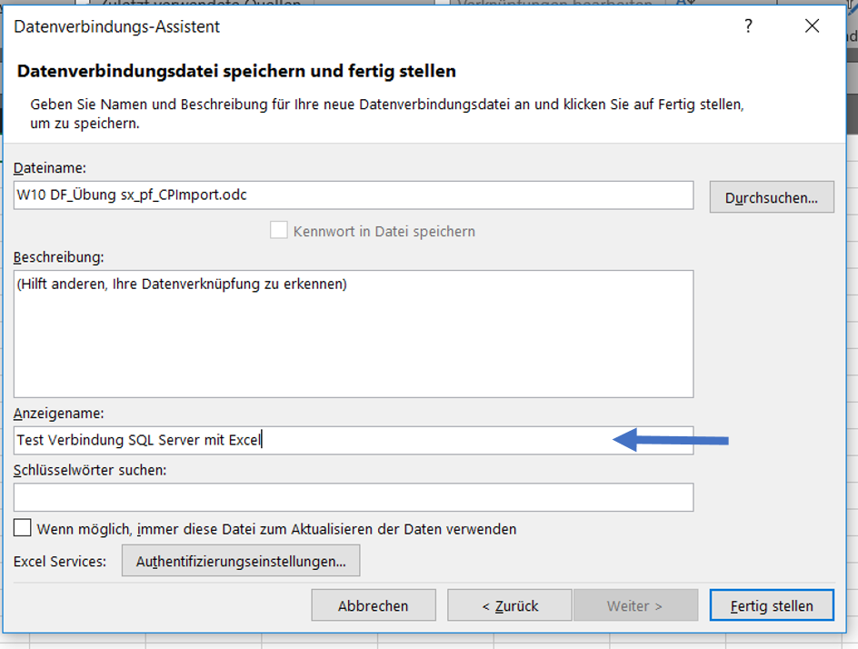
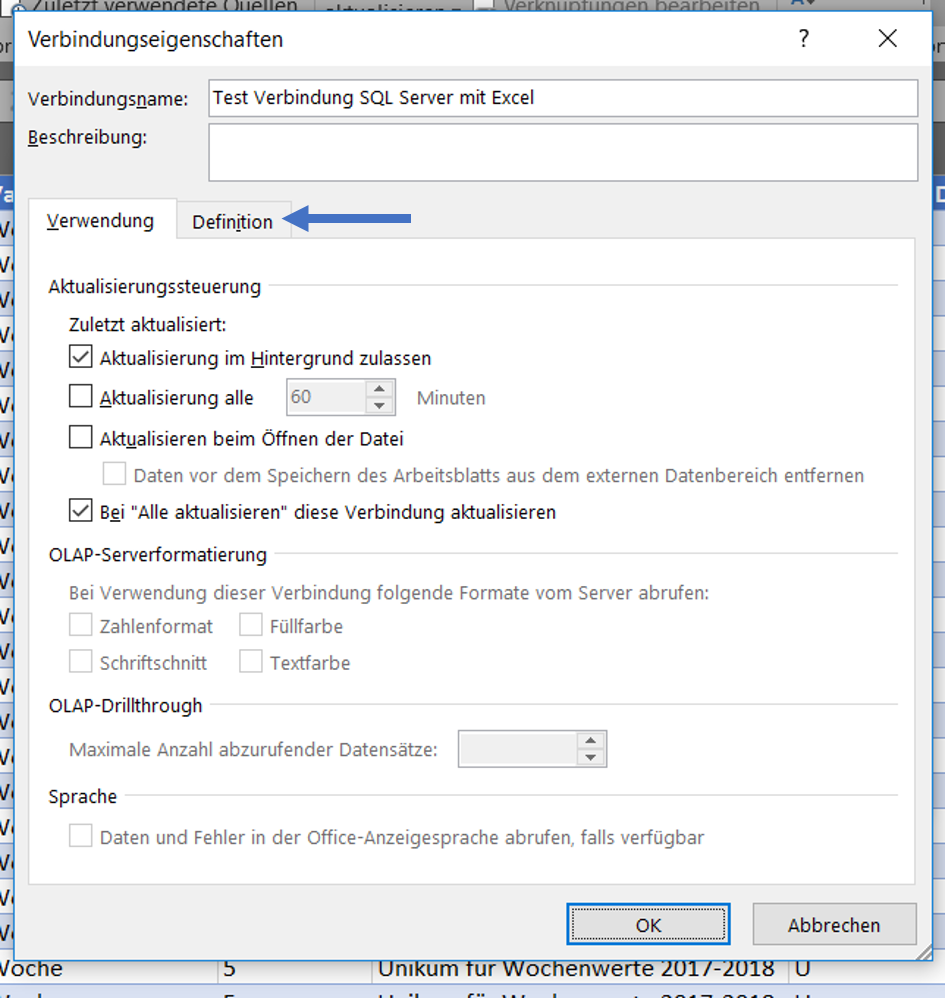
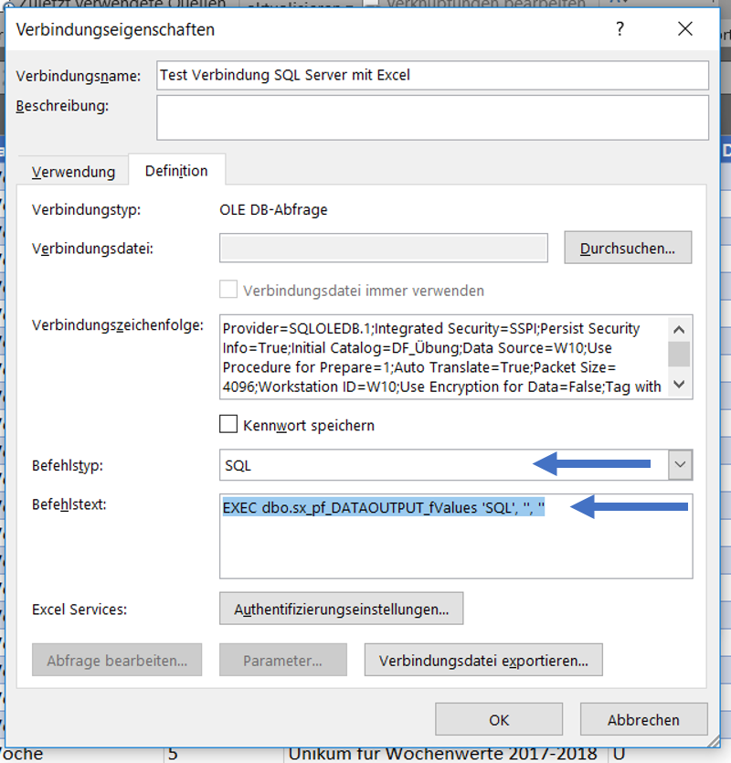
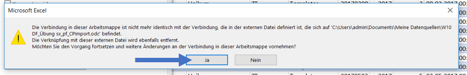

## How to create an Excel table from a SQL procedure

The aim of this manual is to show you how to create a XLS table from a SQL procedure by establishing a connection to a SQL table or view first and adjusting this connection afterwards as Excel is not able to open a SQL procedure directly.

This manual is written for Excel version 2016. The process is identical for Excel versions 2010/2013. 

### Create a new query from SQL server

### Enter the name of SQL server

and use your local login (you don't need to enter neither your username nor your passwort).

### Select the database

and chose any data table or data view .

### Name your data connection file

### Select "Import data as table"

The SQL table or view has now been imported as XLS table into Excel.

### Select "Connections"

in order to change the connection to your desired SQL procedure.

### Select "Properties"

### Select "Definition"

### Change the instruction type and the instruction text
The syntac of the instruction text needs to be as follows:

EXEC *name of your procedure* parameter 1, parameter 2, parameter n

### Commit changes

