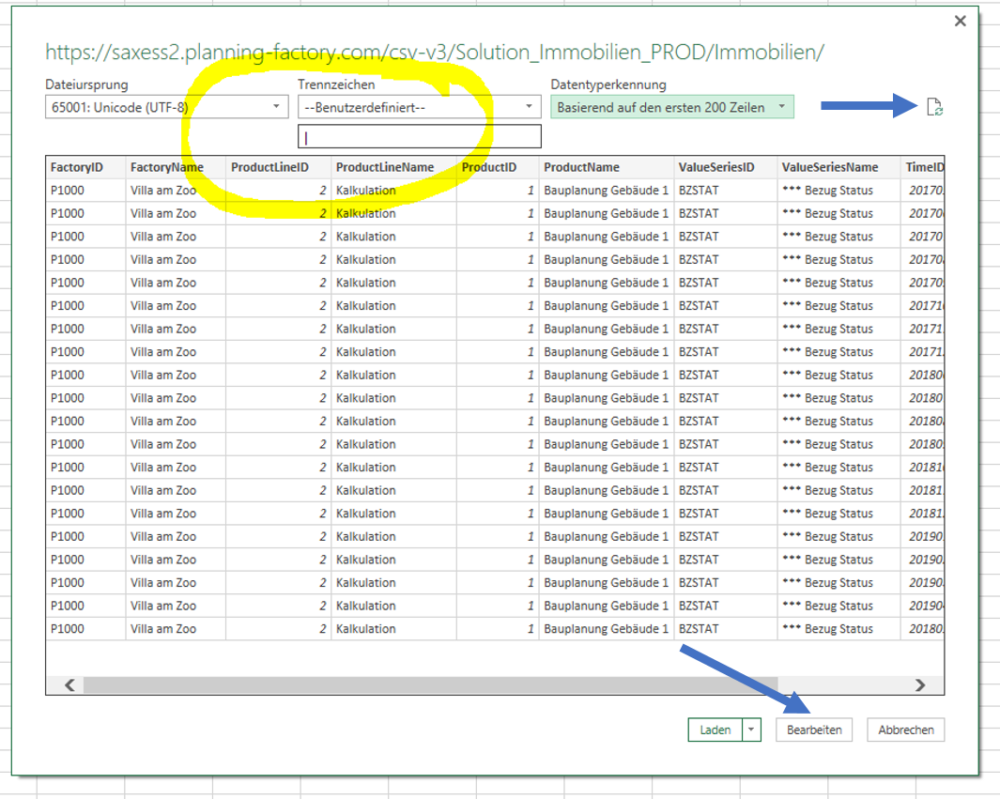
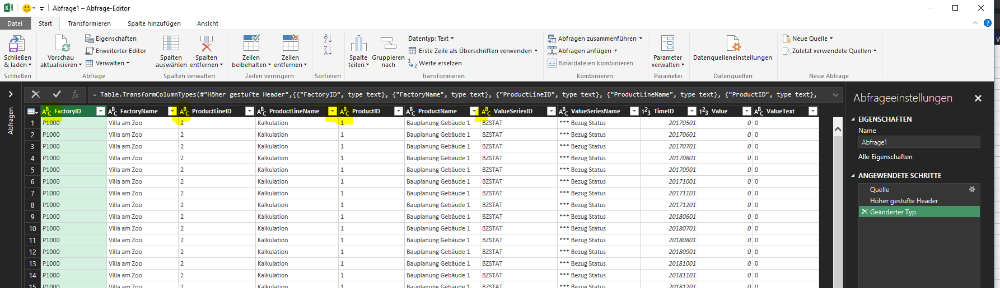
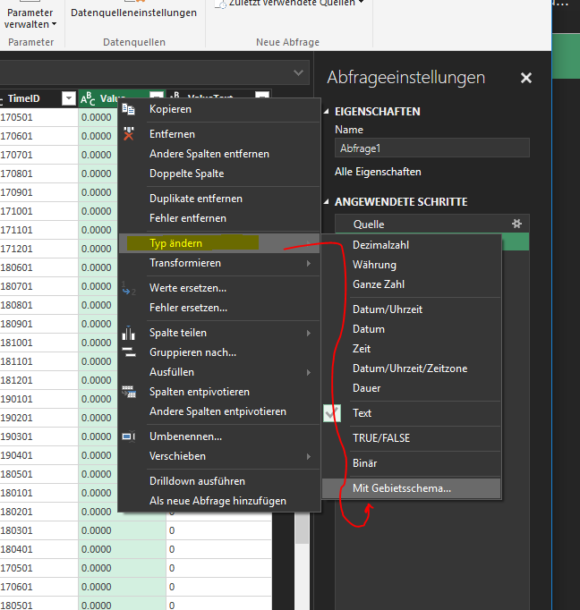
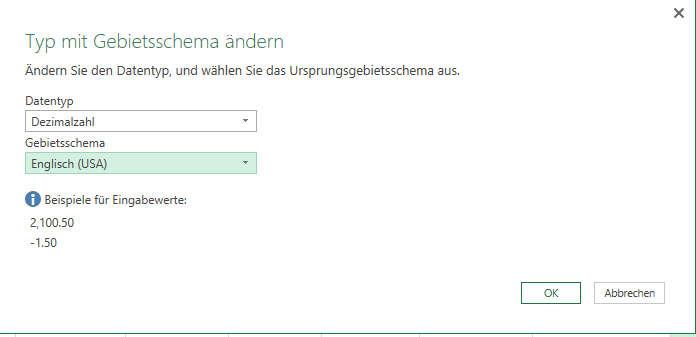
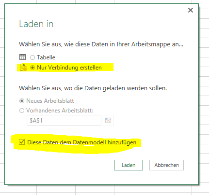
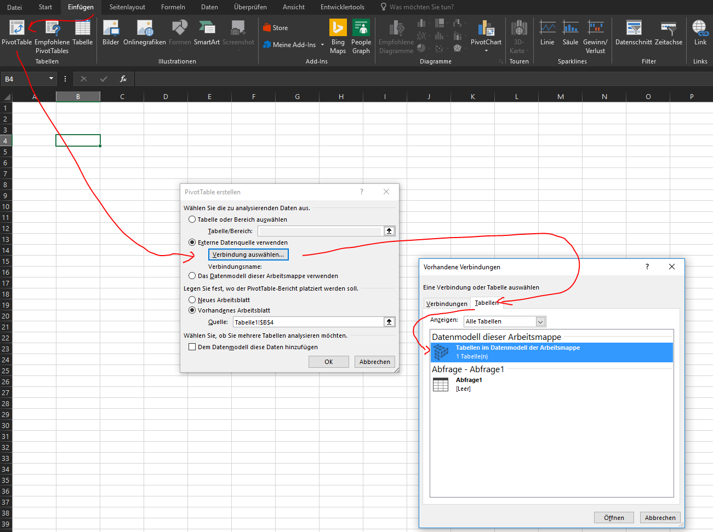
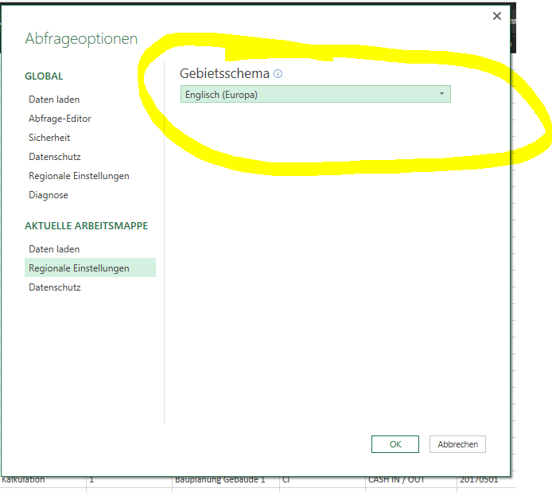

## How to create a local (and refreshable) Pivot Table from the DataFactory Webservice

### Precondition, you have:
* the CSV Download URL for your cluster, it looks like https://saxess2.planning-factory.com/csv-v3/Solution_Immobilien_PROD/Immobilien/
* which means https://saxess2.planning-factory.com/csv-v3/[Cluster]/[DATAOUTPUT_Type]/[FactoryID]/[ProductlineID]
* login credentials
* the Name of the DATAOUTPUT Type you need (e.g. Profit, Balance, Cash) 

This manual is written for Excel 2016, in Excel 2010/2013 the process is similar, but you must have installed the addin PowerQuery on your machine.

### Create a new Query

### Enter your URL and credentials

### Check the column delimiter

If the query has not been loaded correctly/ has not been loaded at all, please use the "refresh"-button. 

In order to move to the next step, please use the "process"-button.

### Delete the automaticly create step for Typ Definition

### Set all ID Columns to Type text and Year Month to type integer

### Set Value Columns to Decimal-US with country coding !

### Load to Datamodel, not into the sheet

### Create a PivotTable

### Select Fields for the PivotTable

### Refresh the Data any time you like

